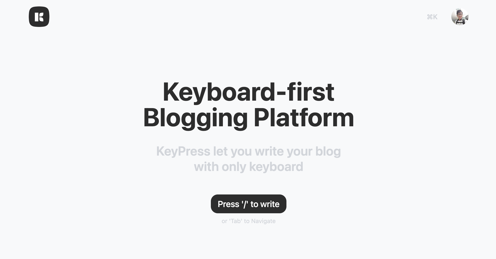

<br />
<p align="center">
  <a href="https://github.com/zernonia/keypress">
    
  </a>
  <br />

  <p align="center">
    A keyboard-first blogging platform. <br> 
    Finally write your blog post only with keys 🎹
  </p>

  <p align="center"> 
    <a href="https://keypress.blog/">View Demo</a>
    ·
    <a href="https://github.com/zernonia/keypress/issues">Report Bug</a>
    ·
    <a href="https://github.com/zernonia/keypress/issues">Request Feature</a>
  </p>
</p>

<br/>



## Introduction

KeyPress is an open-source blogging platform that focused on keyboard-first experience. It was inspired by Vercel's Platform Starter Kit.

I always wanted to build a multi-tenant platform using [Nuxt3](https://v3.nuxtjs.org/), and I finally did it! - in `nuxt-rc11`.

If you are interested to implement the same, checkout

1. [`server/middleware/subdomain.ts`](https://github.com/zernonia/keypress/blob/main/server/middleware/subdomain.ts) - check the current domain and set srr context.
2. [`app/router.option.ts`](https://github.com/zernonia/keypress/blob/main/app/router.options.ts) - based on the ssr context, map a new route.
3. [`pages/user/[siteId]`](https://github.com/zernonia/keypress/tree/main/pages/user/%5BsiteId%5D) - this will now be your new router root

## 🚀 Features

- 🤩 Free
- 📖 Open-Source
- 🚀 Free custom domain
- 🌌 Auto OG image (using [Satori](https://github.com/vercel/satori))

### 🔨 Built With

- [Nuxt 3](https://v3.nuxtjs.org/)
- [Supabase](https://supabase.com)
- [UnoCss](https://uno.antfu.me/)
- [Vercel - Hosting & Domain](https://vercel.com)

## 🌎 Setup

### Prerequisites

Yarn

- ```sh
  npm install --global yarn
  ```

### Development

1. Clone the repo
   ```sh
   git clone https://github.com/zernonia/keypress.git
   ```
2. Install NPM packages
   ```sh
   cd keypress
   yarn install
   ```
3. Run local development instance
   ```sh
   yarn dev
   ```

### Supabase Database

```sql
create table domains (
  user_id uuid,
  url text not null primary key,
  active boolean,
  created_at timestamp default now()
);

create table profiles (
  id uuid default uuid_generate_v4() primary key,
  username text,
  avatar_url text,
  name text,
  created_at timestamp default now(),
  subdomain text references domains (url)
);

create table posts (
  id uuid default uuid_generate_v4() primary key,
  author_id uuid references profiles (id),
  created_at timestamp default now(),
  slug text not null,
  title text,
  body text,
  cover_img text,
  active boolean,
  tags ARRAY,
  featured boolean not null
);


create or replace view tags_view as
  select *, count(*)
  from
    (select unnest(tags) as name from posts where active is true) s
  group by name;


create or replace function public.handle_new_user()
  returns trigger as $$
  begin
    insert into public.profiles (id, avatar_url, username, name)
    values (new.id, new.raw_user_meta_data->>'avatar_url', new.raw_user_meta_data->>'user_name', new.raw_user_meta_data->>'preferred_username');
    return new;
  end;
  $$ language plpgsql security definer;


create trigger on_auth_user_created
  after insert on auth.users
  for each row execute procedure public.handle_new_user();
```

## ➕ Contributing

Contributions are what make the open source community such an amazing place to be learn, inspire, and create. Any contributions you make are **greatly appreciated**.

1. Fork the Project
2. Create your Feature Branch (`git checkout -b feature/AmazingFeature`)
3. Commit your Changes (`git commit -m 'Add some AmazingFeature'`)
4. Push to the Branch (`git push origin feature/AmazingFeature`)
5. Open a Pull Request

## Acknowledgement

1. [Nuxt 3 - Awesome framework](https://v3.nuxtjs.org/)
1. [Supabase - Super easy setup (as always)](https://supabase.com)
1. [Tiptap - Awesome editor](https://tiptap.dev/)
1. [Vercel's Platform Starter Kit - Subdomain/Custom domain](https://github.com/vercel/platforms)
1. [Vercel's new og generation](https://github.com/vercel/satori)

## Author

- Zernonia ([@zernonia](https://twitter.com/zernonia))

Also, if you like my work, please buy me a coffee ☕😳

<a href="https://www.buymeacoffee.com/zernonia" target="_blank">
    
  </a>

## 🔥 Contributors

<a href="https://github.com/zernonia/keypress/graphs/contributors">
  
</a>

## 📜 License

Distributed under the MIT License. See `LICENSE` for more information.
